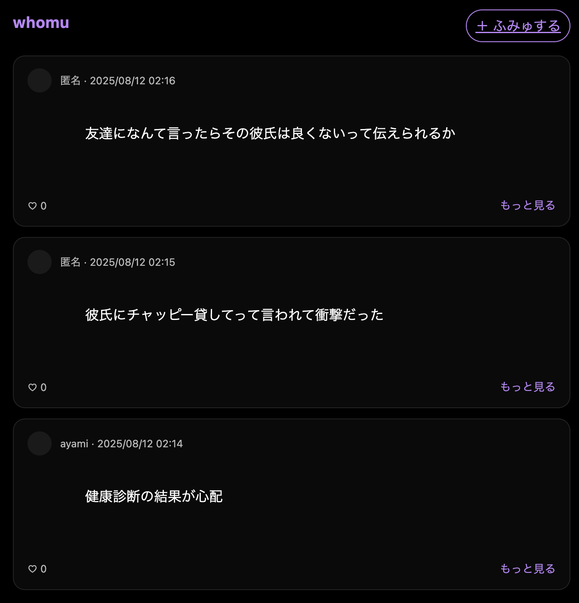
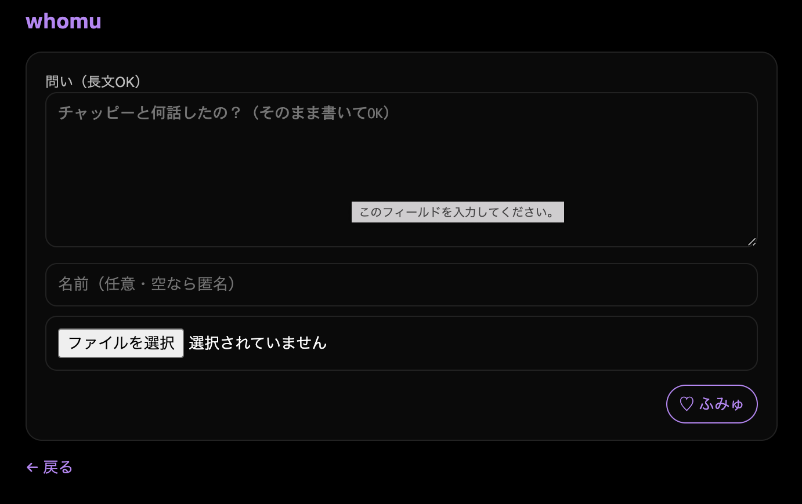

# whomu — What You Ask Is Who You Are
Minimal dark-themed Q&amp;A SNS to share questions you ask AI. Built with Java + Spring Boot.

黒×白×紫のミニマルUIで、「ChatGPTに投げた問い」を共有する**質問ギャラリーSNS**（MVP）。  
**テーマ：**「齟齬のない世界へ」— 人は“何をAIに問うか”で滲み出る。

## Screens
- 一覧（複数投稿、長文は「…もっと見る」）

- 詳細（スクショ画像＋♡ふみゅ）

- 投稿フォーム（PH:「チャッピーと何話したの？」）


## Features (MVP)
- 投稿（長文OK / 画像アップロード対応）
- 一覧（新着順、長文は省略表示→もっと見る）
- 詳細（スクショ表示、♡ふみゅリアクション）
- ダークテーマ：黒 × 白 × 紫

## Tech
- Java 21 / Spring Boot 3.5
- Thymeleaf
- JSON file storage (`questions.json`)  
  画像は `/uploads/` に保存・配信

## Run (Local)
```bash
./mvnw spring-boot:run
# http://localhost:8080
```

## Project Structure
```whomu/
├── docs/                         # スクショや設計資料
│   ├── list.png
│   ├── detail.png
│   └── post.png
├── src/
│   ├── main/
│   │   ├── java/com/example/whomu/
│   │   │   ├── WhomuApplication.java             # メインクラス
│   │   │   ├── controller/
│   │   │   │   ├── QuestionController.java       # 投稿・一覧・詳細ページ
│   │   │   ├── model/
│   │   │   │   ├── Question.java                 # 質問モデル
│   │   │   └── service/
│   │   │       ├── QuestionService.java          # 質問の保存・取得ロジック
│   │   └── resources/
│   │       ├── templates/                        # Thymeleafテンプレート
│   │       │   ├── index.html                    # 一覧画面
│   │       │   ├── detail.html                   # 詳細画面
│   │       │   └── post.html                     # 投稿フォーム
│   │       ├── static/                           # 静的ファイル（CSS, JS, 画像など）
│   │       │   ├── css/
│   │       │   │   └── style.css
│   │       │   └── js/
│   │       │       └── script.js
│   │       └── application.properties            # Spring Boot設定
│   └── test/java/com/example/whomu/
│       └── WhomuApplicationTests.java            # テスト
├── uploads/                       # アップロードされた画像
├── questions.json                  # 質問データ（ローカル保存用）
├── README.md
├── pom.xml                         # Maven設定
└── .gitignore
```

## Road Map
### 📅 開発ロードマップ
### Phase 1: 基本機能（MVP）
 Spring Boot プロジェクト作成

 GitHub リポジトリ作成・push設定（SSH化）

 docs/ フォルダにスクショ保存

 質問投稿フォーム (post.html)

 質問一覧表示 (index.html)

 質問詳細表示 (detail.html)

 ローカルJSONファイル(questions.json)への保存・読み込み

### Phase 2: UI改善
 CSSデザイン適用（レスポンシブ対応）

 質問投稿後のサクセスメッセージ表示

 日付・投稿者名の表示追加

 READMEに画面スクショ埋め込み（サイズ調整済み）

### Phase 3: 画像アップロード機能
 投稿時に画像添付できる機能

 アップロード画像のリサイズ＆圧縮

 uploads/ フォルダに保存＆画面表示

### Phase 4: データベース連携
 MySQLまたはPostgreSQLに移行

 JPAを使った永続化

 環境別設定（dev/prod）

### Phase 5: 公開準備
 READMEに最終的なフォルダ構成・使用技術一覧を追加

 Heroku / Render / Railwayなどでデプロイ

 GitHub ActionsでCI/CD設定


### (English)
# whomu — What You Ask Is Who You Are
A question gallery SNS (MVP) with a black × white × purple minimal UI, showcasing the questions people have asked ChatGPT.
Theme: “Towards a World Without Misunderstandings” — A person’s true self seeps through in what they choose to ask AI.

# Screens
List view: Multiple posts, long texts are truncated with “…see more”

Detail view: Screenshot image + ♡ "whoumu" reaction

Post form: Placeholder — “What did you talk about with Chappy?”


# Features (MVP)
Posting (supports long text / image uploads)

List view (latest first, long text truncated → see more)

Detail view (displays uploaded image, ♡ "Fumu" reaction)

Dark theme: black × white × purple

# Tech Stack
Java 21 / Spring Boot 3.5

Thymeleaf

JSON file storage (questions.json)
Images are stored & served from /uploads/

# Run Locally
```bash
./mvnw spring-boot:run
# http://localhost:8080
```


